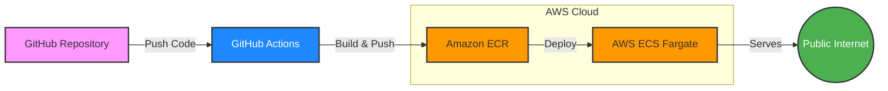

# AWS ECS Deployment with GitHub Actions


## Table of Contents
- [Overview](#overview)
- [Architecture](#architecture)
- [Prerequisites](#prerequisites)
- [AWS Services Configuration](#aws-services-configuration)
- [GitHub Actions Workflow](#github-actions-workflow)
- [Deployment Process](#deployment-process)
- [Repository Structure](#repository-structure)
- [Local Development](#local-development)
- [Network Configuration](#network-configuration)
- [Troubleshooting](#troubleshooting)
- [Future Project Exploration](#future-project-exploration)
- [License](#license)

## Overview

This project demonstrates a complete CI/CD pipeline for deploying a static website to AWS Elastic Container Service (ECS) using GitHub Actions. The workflow automatically builds a Docker container with NGINX, pushes it to Amazon Elastic Container Registry (ECR), and deploys it to an ECS Fargate service. This implementation showcases modern DevOps practices for containerized web applications.

The project includes three different workflow implementations:
1. **Basic Workflow (ecs.yml)**: Uses AWS CLI commands for simple deployment
2. **Enhanced Workflow (ecs_b.yml)**: Uses AWS GitHub Actions for more robust deployment
3. **Security-Enhanced Workflow (ecs_c.yml)**: Adds Trivy security scanning to ensure only secure images are deployed

Each workflow demonstrates different approaches to CI/CD with increasing levels of sophistication and security controls.

## Architecture



- **Frontend**: Simple static website built with HTML5 and CSS3
- **Container**: NGINX Alpine serving static content with optimized configuration
- **CI/CD**: GitHub Actions workflow for automated testing, building, and deployment
- **Infrastructure**: 
  - AWS ECS Fargate for serverless container orchestration
  - AWS ECR for secure Docker image storage
  - AWS VPC with public subnets for container networking
  - Security groups for network traffic control

## Prerequisites

- AWS Account with appropriate IAM permissions
- GitHub account with repository access
- Basic understanding of Docker, AWS, and CI/CD concepts
- Docker installed locally for development and testing
- AWS CLI configured for local testing (optional)

## AWS Services Configuration

### 1. Elastic Container Registry (ECR)
- Create a repository in ECR to store Docker images
- Note the repository URI for GitHub Actions configuration

### 2. Elastic Container Service (ECS)
- Create an ECS cluster (Fargate launch type recommended)
- Create a task definition using the provided `task-definition.json`
- Configure the service with desired count, networking, and load balancing options

### 3. IAM Configuration
- Create an IAM user with programmatic access for GitHub Actions
- Attach policies for ECR and ECS access:
  ```json
  {
      "Version": "2012-10-17",
      "Statement": [
          {
              "Effect": "Allow",
              "Action": [
                  "ecr:GetAuthorizationToken",
                  "ecr:BatchCheckLayerAvailability",
                  "ecr:GetDownloadUrlForLayer",
                  "ecr:BatchGetImage",
                  "ecr:InitiateLayerUpload",
                  "ecr:UploadLayerPart",
                  "ecr:CompleteLayerUpload",
                  "ecr:PutImage",
                  "ecs:UpdateService"
              ],
              "Resource": "*"
          }
      ]
  }
  ```

### 4. VPC and Security Groups
- Ensure your ECS service uses a VPC with public subnets
- Configure security groups to allow inbound traffic on port 80

## GitHub Actions Workflows

### Primary Workflow (ecs.yml)

The primary workflow in `.github/workflows/ecs.yml` performs the following steps:

1. **Checkout Code**: Retrieves the latest code from the repository
2. **Set up AWS Credentials**: Configures AWS authentication using repository secrets
3. **Log in to Amazon ECR**: Authenticates with the container registry
4. **Build Docker Image**: Creates a container image from the Dockerfile
5. **Tag Docker Image**: Labels the image with the appropriate ECR repository URI
6. **Push to ECR**: Uploads the image to Amazon ECR
7. **Update ECS Service**: Triggers a new deployment of the ECS service using AWS CLI

This workflow includes a `paths-ignore` configuration to prevent unnecessary deployments when certain files are changed:
```yaml
paths-ignore:
  - .github/workflows/ecs.yml
  - README.md
  - LICENSE
  - .gitignore
  - Dockerfile
  - src/**
```

### Alternative Workflow (ecs_b.yml)

An alternative workflow in `.github/workflows/ecs_b.yml` achieves the same result but uses AWS GitHub Actions for ECS deployment:

1. **Checkout Code**: Retrieves the latest code from the repository
2. **Set up AWS Credentials**: Configures AWS authentication using repository secrets
3. **Log in to Amazon ECR**: Authenticates with the container registry
4. **Build Docker Image**: Creates a container image from the Dockerfile
5. **Tag Docker Image**: Labels the image with the appropriate ECR repository URI
6. **Push to ECR**: Uploads the image to Amazon ECR
7. **Render Task Definition**: Uses `aws-actions/amazon-ecs-render-task-definition` to update the task definition with the new image
8. **Debug Task Definition**: Outputs the rendered task definition for troubleshooting
9. **Deploy to ECS**: Uses `aws-actions/amazon-ecs-deploy-task-definition` to deploy the updated task definition and waits for service stability

This alternative workflow provides more robust ECS deployment by:
- Using official AWS GitHub Actions for ECS deployment
- Updating the task definition with the new image
- Waiting for service stability before completing
- Providing debug output for troubleshooting

### Security-Enhanced Workflow (ecs_c.yml)

A third workflow in `.github/workflows/ecs_c.yml` adds security scanning to the deployment process:

1. **Checkout Code**: Retrieves the latest code from the repository
2. **Set up AWS Credentials**: Configures AWS authentication using repository secrets
3. **Log in to Amazon ECR**: Authenticates with the container registry
4. **Build Docker Image**: Creates a container image from the Dockerfile with security patches
5. **Security Scan**: Uses Trivy to scan the Docker image for vulnerabilities
6. **Tag Docker Image**: Labels the image with the appropriate ECR repository URI
7. **Push to ECR**: Uploads the image to Amazon ECR
8. **Render Task Definition**: Updates the task definition with the new image
9. **Debug Task Definition**: Outputs the rendered task definition for troubleshooting
10. **Deploy to ECS**: Deploys the updated task definition and waits for service stability

This security-enhanced workflow adds an important layer of protection by:
- Scanning the Docker image for HIGH and CRITICAL vulnerabilities before deployment
- Using a specific version of nginx (1.28.0-alpine) with security patches applied
- Updating vulnerable packages (like libxml2) during the Docker build process
- Failing the deployment if security issues are found
- Ensuring only secure images are deployed to production

✅ **Status**: This workflow is now running successfully with all security checks passing.

### Required GitHub Secrets

Configure these secrets in your GitHub repository settings:
- `AWS_ACCESS_KEY_ID`: IAM user access key
- `AWS_SECRET_ACCESS_KEY`: IAM user secret key
- `AWS_REGION`: AWS region (e.g., us-east-1)
- `ECR_REPOSITORY_URI`: Full URI of your ECR repository
- `ECS_CLUSTER`: Name of your ECS cluster
- `ECS_SERVICE`: Name of your ECS service
- `CONTAINER_NAME`: Name of the container in your task definition (required for ecs_b.yml workflow)

## Deployment Process

1. Developer commits and pushes code changes to the main branch
2. GitHub Actions workflow is automatically triggered
3. Docker container is built with the latest code
4. Container image is tagged and pushed to Amazon ECR
5. ECS service is updated to use the new container image
6. Fargate pulls the new image and deploys new containers
7. Old containers are gracefully terminated after new ones are healthy

## Repository Structure

```
.
├── .github/workflows/    # GitHub Actions workflow definitions
│   ├── ecs.yml          # Primary CI/CD workflow file using AWS CLI
│   ├── ecs_b.yml        # Alternative workflow using AWS GitHub Actions
│   └── ecs_c.yml        # Security-enhanced workflow with Trivy scanning
├── assets/              # Static assets directory
│   └── img/             # Image assets for the website
│       ├── background.jpg
│       └── logo.png
├── Dockerfile           # NGINX container configuration with security patches
├── index.html           # Main HTML file for the website
├── style.css            # CSS styling for the website
├── task-definition.json # AWS ECS task definition template
├── LICENSE              # Project license information
└── README.md            # Project documentation
```

## Local Development

### Running Locally with Docker

1. Clone the repository:
   ```bash
   git clone https://github.com/yourusername/aws-ecs-deployment.git
   cd aws-ecs-deployment
   ```

2. Build the Docker image:
   ```bash
   docker build -t brand-site-app:local .
   ```

3. Run the container locally:
   ```bash
   docker run -p 8080:80 brand-site-app:local
   ```

4. Access the website at http://localhost:8080

### Testing the Deployment Locally

To test the full deployment process locally before pushing to GitHub:

1. Configure AWS CLI with your credentials
2. Log in to ECR:
   ```bash
   aws ecr get-login-password --region your-region | docker login --username AWS --password-stdin your-account-id.dkr.ecr.your-region.amazonaws.com
   ```

3. Build and tag the image:
   ```bash
   docker build -t your-account-id.dkr.ecr.your-region.amazonaws.com/your-repo:latest .
   ```

4. Push to ECR:
   ```bash
   docker push your-account-id.dkr.ecr.your-region.amazonaws.com/your-repo:latest
   ```

## Network Configuration

To access the website publicly, port 80 must be explicitly allowed in the default security group. The default rule that allows all traffic was only permitting traffic from within the security group itself, not from external sources.

### Security Group Configuration

1. Navigate to the EC2 Dashboard in AWS Console
2. Select "Security Groups" from the left navigation
3. Find the security group associated with your ECS service
4. Edit inbound rules and add:
   - Type: HTTP
   - Protocol: TCP
   - Port Range: 80
   - Source: 0.0.0.0/0 (or restrict to specific IP ranges for better security)

## Troubleshooting

### Common Issues and Solutions

1. **GitHub Actions Workflow Failure**
   - Check that all required secrets are correctly configured
   - Verify IAM permissions are sufficient for all operations
   - For security scan failures, update vulnerable packages in the Dockerfile (see our solution for libxml2)

2. **Container Not Deploying**
   - Ensure ECS service is configured correctly
   - Check CloudWatch logs for container startup issues
   - Verify task definition is valid and resources are sufficient

3. **Website Not Accessible**
   - Confirm security group allows inbound traffic on port 80
   - Check if containers are running in ECS console
   - Verify network configuration in task definition

### Viewing Logs

Access container logs through CloudWatch:
1. Navigate to CloudWatch in AWS Console
2. Select "Log Groups"
3. Find the log group matching your ECS task definition
4. Select the latest log stream to view container output

## Future Project Exploration

- **Security Enhancements**:
  - Implement HTTPS using AWS Certificate Manager and Application Load Balancer
  - Add Web Application Firewall (WAF) protection
  - Implement more restrictive security group rules

- **CI/CD Improvements**:
  - Add automated testing before deployment
  - Implement code quality checks and linting
  - Set up branch protection rules and pull request workflows

- **Infrastructure Improvements**:
  - Implement infrastructure as code using AWS CDK or Terraform
  - Create multi-environment deployment pipeline (dev, staging, prod)
  - Set up monitoring and alerting with CloudWatch

- **Feature Enhancements**:
  - Implement a custom domain name with Route 53
  - Add content management capabilities
  - Implement blue/green deployment strategy
  - Add CDN integration with CloudFront

## License

This project is licensed under the terms of the [LICENSE](LICENSE) file included in this repository.

---

Powered by Blakk Brother Inc